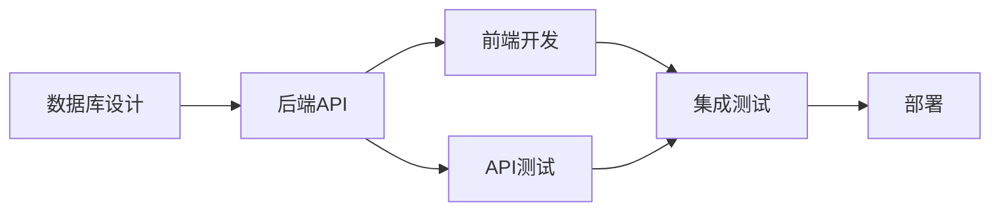

# 模块：大任务处理与管理

## 任务复杂度评估

### 评估标准
| 维度 | 小任务 | 中任务 | 大任务 |
|------|--------|--------|--------|
| **时间** | < 2小时 | 2-8小时 | > 8小时 |
| **模块** | 1个 | 2-3个 | > 3个 |
| **依赖** | 无 | 简单依赖 | 复杂依赖 |
| **风险** | 低 | 中 | 高 |

### 触发大任务模式
```python
def should_use_task_management(task):
    if task.estimated_time > 8:
        return True
    if task.module_count > 3:
        return True
    if task.has_complex_dependencies:
        return True
    return False
```

## 三层任务架构

### 第一层：战略规划（Strategic）
```markdown
## 任务：[大任务名称]

### 目标
- 主要目标
- 成功标准
- 交付物

### 风险评估
- 技术风险
- 时间风险
- 资源风险

### 技术决策
- 架构选择
- 技术栈确定
- 接口设计
```

### 第二层：战术分解（Tactical）
```markdown
## 任务分解

### 阶段1：准备（20%）
- [ ] 需求分析
- [ ] 技术调研
- [ ] 环境搭建

### 阶段2：开发（60%）
- [ ] 核心功能
- [ ] 辅助功能
- [ ] 集成测试

### 阶段3：完善（20%）
- [ ] 优化重构
- [ ] 文档编写
- [ ] 部署准备
```

### 第三层：执行跟踪（Operational）
```markdown
## 执行清单

### 当前任务
- [x] Task-001: 数据库设计 (2h) ✅
- [x] Task-002: API接口 (3h) ✅
- [ ] Task-003: 前端界面 (4h) 🚧
- [ ] Task-004: 测试用例 (2h) 📋

### 进度指标
- 完成: 5/10 (50%)
- 耗时: 12h / 24h
- 阻塞: 0
```

## 任务编排模式

### 瀑布模式
```
需求 → 设计 → 开发 → 测试 → 部署
```
**适用**: 需求明确、低不确定性

### 并行模式
```
    ┌→ 前端开发 →┐
设计 → 后端开发 → 集成
    └→ 数据库  →┘
```
**适用**: 模块独立、可并行

### 迭代模式
```
Sprint 1 → Sprint 2 → Sprint 3
  ↓          ↓          ↓
MVP v1    MVP v2     Release
```
**适用**: 需求模糊、探索性

## 依赖管理

### 依赖类型
```yaml
dependencies:
  blocking:    # 阻塞性依赖
    - database_setup
    - api_design

  soft:        # 软依赖
    - ui_mockups
    - test_data

  external:    # 外部依赖
    - third_party_api
    - client_approval
```

### 依赖图示例


## 优先级管理

### 优先级矩阵
```
重要度 ↑
    ┌─────────┬─────────┐
    │   P0    │   P1    │
    │ 立即做  │ 计划做  │
    ├─────────┼─────────┤
    │   P2    │   P3    │
    │ 可延后  │ 可选做  │
    └─────────┴─────────┘
            紧急度 →
```

### 优先级规则
- **P0**: 阻塞其他任务的
- **P1**: 核心功能相关
- **P2**: 增强体验的
- **P3**: nice-to-have

## 进度监控

### 甘特图模板
```
任务        周1  周2  周3  周4
─────────────────────────────
需求分析    ████
设计        　　████
前端开发    　　　　████████
后端开发    　　　████████
测试        　　　　　　████
部署        　　　　　　　　██
```

### 燃尽图
```
剩余工作量
100 |*
 80 |  *
 60 |    *
 40 |      *
 20 |        *
  0 |__________*
    Day1  Day5  Day10
```

## 风险管理

### 风险登记表
| 风险 | 概率 | 影响 | 应对策略 |
|------|------|------|----------|
| API延迟高 | 中 | 高 | 增加缓存层 |
| 需求变更 | 高 | 中 | 敏捷迭代 |
| 技术难题 | 低 | 高 | 技术储备 |

### 风险应对
1. **规避**: 改变计划避免风险
2. **缓解**: 降低概率或影响
3. **转移**: 外包或保险
4. **接受**: 制定应急计划

## 团队协作

### 任务分配原则
```python
def assign_task(task, team):
    # 技能匹配
    if task.requires_skill in member.skills:
        assign_to(member)

    # 负载均衡
    if member.workload < threshold:
        assign_to(member)

    # 经验考虑
    if task.difficulty > high:
        assign_to(senior_member)
```

### 沟通机制
- **每日站会**: 15分钟同步
- **周会**: 1小时规划
- **评审会**: 阶段性review

## 检查点（Checkpoint）

### 阶段检查清单
```markdown
## 阶段1检查
- [ ] 需求确认无误
- [ ] 技术方案可行
- [ ] 资源到位
- [ ] 风险已识别

## 阶段2检查
- [ ] 核心功能完成
- [ ] 单元测试通过
- [ ] 代码审查完成
- [ ] 文档更新

## 阶段3检查
- [ ] 集成测试通过
- [ ] 性能达标
- [ ] 部署准备就绪
- [ ] 回滚方案ready
```

## 任务模板

### 大任务启动模板
```markdown
# 任务：[名称]

## 概述
- 背景：
- 目标：
- 范围：

## 里程碑
- M1: [日期] - [交付物]
- M2: [日期] - [交付物]
- M3: [日期] - [交付物]

## 资源需求
- 人力：
- 时间：
- 预算：

## 成功标准
- [ ] 标准1
- [ ] 标准2
- [ ] 标准3
```

## 最佳实践

### DO ✅
- 提前识别依赖
- 预留buffer时间
- 定期checkpoint
- 及时沟通阻塞
- 记录决策原因

### DON'T ❌
- 过度细化任务
- 忽视风险评估
- 跳过测试阶段
- 单点依赖
- 延迟问题上报

## 工具集成

### 与其他模块配合
```bash
/load task-management, workflow
# 大任务+标准流程

/load task-management, dev-logs
# 任务管理+自动记录

/load task-management, testing
# 任务分解+测试计划
```

---
**模块类型**：项目管理
**适用场景**：大型任务、多人协作、复杂项目
**配合模块**：workflow, dev-logs, testing