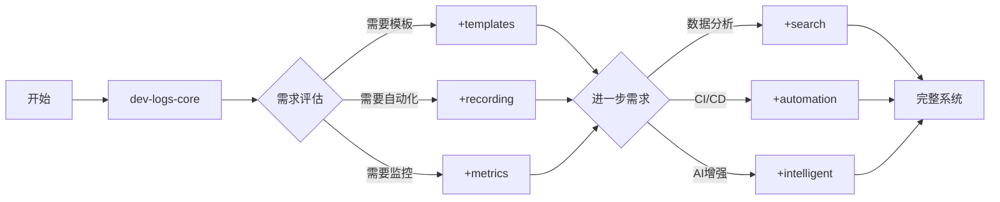

# 模块：AI 开发记录系统（模块化版本）

> ⚠️ **重要**: 此模块已重构为模块化结构，请使用 `05-dev-logs-core.md` 作为入口

## 🎯 快速开始

```bash
# 加载核心功能（轻量级，适合个人项目）
/load dev-logs-core

# 加载核心 + 基础功能（适合团队项目）
/load dev-logs-core, dev-logs/recording, dev-logs/templates

# 加载完整功能（适合企业级项目）
/load dev-logs-core, dev-logs/*
```

## 📦 模块结构

```
claude-prompts/
├── 05-dev-logs-core.md          # ⭐ 核心模块（必需）
└── dev-logs/                    # 📂 子模块目录
    ├── 05a-recording.md          # 记录规则与行为
    ├── 05b-templates.md          # 模板系统
    ├── 05c-metrics.md            # 质量指标追踪
    ├── 05d-search.md             # 查询和分析工具
    ├── 05e-automation.md         # 自动化与集成
    ├── 05f-intelligent.md        # 智能记录功能
    └── 05g-practices.md          # 最佳实践指南
```

## 🚀 使用指南

### 1. 个人开发者（最简配置）
```bash
# 只需要核心功能
/load dev-logs-core

# 初始化最小化结构
.\claude-prompts\scripts\init-dev-logs.ps1 -Level minimal
```

### 2. 小型团队（标准配置）
```bash
# 核心 + 模板 + 记录规则
/load dev-logs-core, dev-logs/recording, dev-logs/templates

# 初始化标准结构
.\claude-prompts\scripts\init-dev-logs.ps1 -Level standard
```

### 3. 大型项目（完整配置）
```bash
# 加载所有模块
/load dev-logs-core, dev-logs/*

# 初始化企业级结构
.\claude-prompts\scripts\init-dev-logs.ps1 -Level enterprise -WithDashboard -WithGitHooks
```

## 📊 模块对比

| 子模块 | 大小 | 依赖 | 适用场景 | 优先级 |
|--------|------|------|----------|--------|
| **core** | ~200行 | 无 | 所有项目 | 必需 |
| **recording** | ~150行 | core | 需要自动记录 | 高 |
| **templates** | ~320行 | core | 标准化格式 | 高 |
| **metrics** | ~250行 | core | 质量监控 | 中 |
| **search** | ~200行 | core | 历史查询 | 中 |
| **automation** | ~130行 | core | CI/CD集成 | 低 |
| **intelligent** | ~90行 | core | AI增强 | 低 |
| **practices** | ~160行 | core | 参考指南 | 可选 |

## 🎨 功能选择器

根据您的需求选择合适的模块组合：

### 场景1：快速原型开发
```bash
/load dev-logs-core
# 仅基础记录功能，轻量快速
```

### 场景2：标准Web项目
```bash
/load dev-logs-core, dev-logs/recording, dev-logs/templates
# 自动记录 + 标准模板
```

### 场景3：质量驱动项目
```bash
/load dev-logs-core, dev-logs/templates, dev-logs/metrics
# 模板 + 质量监控
```

### 场景4：数据分析项目
```bash
/load dev-logs-core, dev-logs/metrics, dev-logs/search
# 指标追踪 + 数据查询
```

### 场景5：DevOps项目
```bash
/load dev-logs-core, dev-logs/automation, dev-logs/metrics
# 自动化 + 监控
```

### 场景6：AI辅助开发
```bash
/load dev-logs-core, dev-logs/intelligent, dev-logs/templates
# 智能功能 + 模板
```

### 场景7：企业级项目
```bash
/load dev-logs-core, dev-logs/*
# 全功能启用
```

## 📈 渐进式采用路径



## 💡 最佳实践建议

1. **从小开始**：先使用核心模块，根据需要逐步添加
2. **按需加载**：只加载实际需要的功能，避免过度配置
3. **定期评估**：每个迭代评估是否需要新功能
4. **团队协作**：团队项目建议至少包含 templates 和 recording
5. **质量优先**：重视质量的项目应包含 metrics 模块

## 🔧 快速命令

```bash
# 查看可用模块
ls claude-prompts/dev-logs/

# 查看模块大小
wc -l claude-prompts/dev-logs/*.md

# 初始化记录系统
.\claude-prompts\scripts\init-dev-logs.ps1

# 生成今日总结
node .ai-dev-logs/scripts/daily-summary.js

# 查看仪表板
start .ai-dev-logs/dashboard/index.html
```

## 📚 更多信息

- 详细功能说明：查看各子模块文件
- 配置示例：参考 `dev-logs/05g-practices.md`
- 故障排除：参考 `dev-logs/05g-practices.md#故障排除`

---

**版本**: 3.0.0（模块化重构）
**更新**: 2024-11-08
**作者**: AI Assistant
**优势**:
- ✅ 按需加载，减少复杂度
- ✅ 模块独立，便于维护
- ✅ 灵活组合，适应不同场景
- ✅ 渐进式采用，降低学习成本
- ✅ 性能优化，减少资源占用