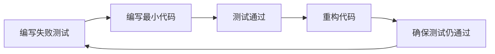

# 模块：测试规范与策略

## 测试驱动开发（TDD）

### 红-绿-重构循环


### TDD 实践步骤
```typescript
// Step 1: 红 - 写一个失败的测试
describe('Calculator', () => {
  it('should add two numbers', () => {
    const result = add(2, 3);
    expect(result).toBe(5); // 失败：add未定义
  });
});

// Step 2: 绿 - 最小实现
function add(a: number, b: number): number {
  return a + b; // 最简单的实现
}

// Step 3: 重构 - 优化实现
function add(...numbers: number[]): number {
  return numbers.reduce((sum, n) => sum + n, 0);
}
```

## 测试金字塔

```
           /\
          /  \        E2E测试 (5-10%)
         /    \       - 用户场景
        /──────\      - 关键路径
       /        \
      /──────────\    集成测试 (20-30%)
     /            \   - API测试
    /──────────────\  - 服务间交互
   /                \
  /──────────────────\ 单元测试 (60-70%)
                       - 函数测试
                       - 类测试
```

## 测试类型详解

### 单元测试
```javascript
// Jest 示例
describe('UserService', () => {
  let userService: UserService;

  beforeEach(() => {
    userService = new UserService();
  });

  describe('createUser', () => {
    it('should create user with valid data', () => {
      const userData = { name: 'John', email: 'john@test.com' };
      const user = userService.createUser(userData);

      expect(user).toMatchObject(userData);
      expect(user.id).toBeDefined();
    });

    it('should throw error with invalid email', () => {
      const userData = { name: 'John', email: 'invalid' };

      expect(() => userService.createUser(userData))
        .toThrow('Invalid email format');
    });
  });
});
```

### 集成测试
```javascript
// Supertest 示例
describe('POST /api/users', () => {
  it('should create a new user', async () => {
    const response = await request(app)
      .post('/api/users')
      .send({
        name: 'John Doe',
        email: 'john@example.com'
      })
      .expect(201);

    expect(response.body).toHaveProperty('id');
    expect(response.body.name).toBe('John Doe');
  });

  it('should return 400 for invalid data', async () => {
    const response = await request(app)
      .post('/api/users')
      .send({ name: 'John' }) // 缺少email
      .expect(400);

    expect(response.body.error).toBeDefined();
  });
});
```

### E2E测试
```javascript
// Playwright 示例
test('user registration flow', async ({ page }) => {
  await page.goto('/register');

  // 填写表单
  await page.fill('#name', 'John Doe');
  await page.fill('#email', 'john@example.com');
  await page.fill('#password', 'SecurePass123!');

  // 提交
  await page.click('button[type="submit"]');

  // 验证跳转
  await expect(page).toHaveURL('/dashboard');
  await expect(page.locator('.welcome')).toContainText('Welcome, John');
});
```

## 测试策略

### 测试覆盖率目标
```yaml
coverage:
  statements: 80%   # 语句覆盖
  branches: 75%     # 分支覆盖
  functions: 80%    # 函数覆盖
  lines: 80%        # 行覆盖

critical_paths:
  payment: 95%      # 支付相关
  authentication: 90% # 认证相关
  core_business: 85%  # 核心业务
```

### 测试命名规范
```javascript
// 格式：should [预期行为] when [条件]
it('should return user data when valid ID is provided', () => {});
it('should throw error when user not found', () => {});
it('should update cache when data changes', () => {});

// 描述嵌套
describe('UserController', () => {
  describe('GET /users/:id', () => {
    describe('with valid ID', () => {
      it('should return user data', () => {});
    });

    describe('with invalid ID', () => {
      it('should return 404', () => {});
    });
  });
});
```

## Mock 和 Stub 策略

### Mock 示例
```javascript
// Jest mock
jest.mock('../services/EmailService');

test('should send welcome email', async () => {
  const mockSendEmail = jest.fn().mockResolvedValue(true);
  EmailService.sendEmail = mockSendEmail;

  await userService.registerUser(userData);

  expect(mockSendEmail).toHaveBeenCalledWith(
    userData.email,
    'Welcome!'
  );
});
```

### Stub 示例
```javascript
// Sinon stub
const databaseStub = sinon.stub(database, 'query');
databaseStub.returns(Promise.resolve([{ id: 1, name: 'Test' }]));

const result = await repository.findAll();
expect(result).to.have.length(1);

databaseStub.restore();
```

## 测试数据管理

### 测试数据工厂
```javascript
// Factory 模式
class UserFactory {
  static build(overrides = {}) {
    return {
      id: faker.datatype.uuid(),
      name: faker.name.findName(),
      email: faker.internet.email(),
      createdAt: new Date(),
      ...overrides
    };
  }

  static buildList(count, overrides = {}) {
    return Array.from({ length: count },
      () => this.build(overrides));
  }
}

// 使用
const user = UserFactory.build({ name: 'John' });
const users = UserFactory.buildList(5);
```

### 测试数据清理
```javascript
beforeEach(async () => {
  await database.clear();
  await seedTestData();
});

afterEach(async () => {
  await database.clear();
});

afterAll(async () => {
  await database.close();
});
```

## 性能测试

### 基准测试
```javascript
// Benchmark.js
suite('String operations', () => {
  benchmark('concat', () => {
    'hello' + 'world';
  });

  benchmark('template', () => {
    `hello${'world'}`;
  });
});

// 负载测试配置
{
  "scenarios": {
    "constant_load": {
      "executor": "constant-vus",
      "vus": 100,
      "duration": "5m"
    },
    "ramping": {
      "executor": "ramping-vus",
      "stages": [
        { "duration": "2m", "target": 100 },
        { "duration": "5m", "target": 100 },
        { "duration": "2m", "target": 0 }
      ]
    }
  }
}
```

## 测试报告

### 报告格式
```markdown
## 测试执行报告

### 执行概览
- 总测试数：156
- 通过：150 (96.15%)
- 失败：4 (2.56%)
- 跳过：2 (1.28%)
- 执行时间：45.3s

### 覆盖率报告
| 类型 | 覆盖率 | 目标 | 状态 |
|------|--------|------|------|
| 语句 | 82.5% | 80% | ✅ |
| 分支 | 76.3% | 75% | ✅ |
| 函数 | 85.2% | 80% | ✅ |
| 行数 | 81.8% | 80% | ✅ |

### 失败测试详情
1. UserService > createUser > validation
   - 错误：Expected 400, received 500
   - 文件：user.service.test.js:45

### 性能指标
- 平均响应时间：120ms
- P95响应时间：450ms
- P99响应时间：800ms
```

## 持续集成测试

### CI 配置示例
```yaml
# .github/workflows/test.yml
name: Tests

on: [push, pull_request]

jobs:
  test:
    runs-on: ubuntu-latest

    steps:
      - uses: actions/checkout@v2

      - name: Setup Node
        uses: actions/setup-node@v2
        with:
          node-version: '16'

      - name: Install dependencies
        run: npm ci

      - name: Run linter
        run: npm run lint

      - name: Run tests
        run: npm test -- --coverage

      - name: Upload coverage
        uses: codecov/codecov-action@v2
```

## 测试最佳实践

### FIRST 原则
- **F**ast - 测试应该快速运行
- **I**ndependent - 测试相互独立
- **R**epeatable - 可重复执行
- **S**elf-Validating - 自动验证
- **T**imely - 及时编写

### AAA 模式
```javascript
test('should calculate discount', () => {
  // Arrange - 准备
  const price = 100;
  const discountRate = 0.1;

  // Act - 执行
  const result = calculateDiscount(price, discountRate);

  // Assert - 断言
  expect(result).toBe(90);
});
```

### 测试清单
- [ ] 正常路径测试
- [ ] 边界条件测试
- [ ] 异常处理测试
- [ ] 并发场景测试
- [ ] 性能基准测试

## 测试工具推荐

### JavaScript/TypeScript
- 单元测试：Jest, Mocha, Vitest
- 集成测试：Supertest
- E2E测试：Playwright, Cypress
- 覆盖率：Istanbul, C8

### 其他语言
| 语言 | 单元测试 | 集成测试 | E2E测试 |
|------|----------|----------|---------|
| Python | pytest | pytest + requests | Selenium |
| Java | JUnit | TestContainers | Selenium |
| Go | testing | httptest | Chromedp |
| C# | NUnit | TestServer | Playwright |

---
**模块类型**：质量保证
**适用场景**：TDD开发、测试策略制定、CI/CD配置
**配合模块**：workflow, principles