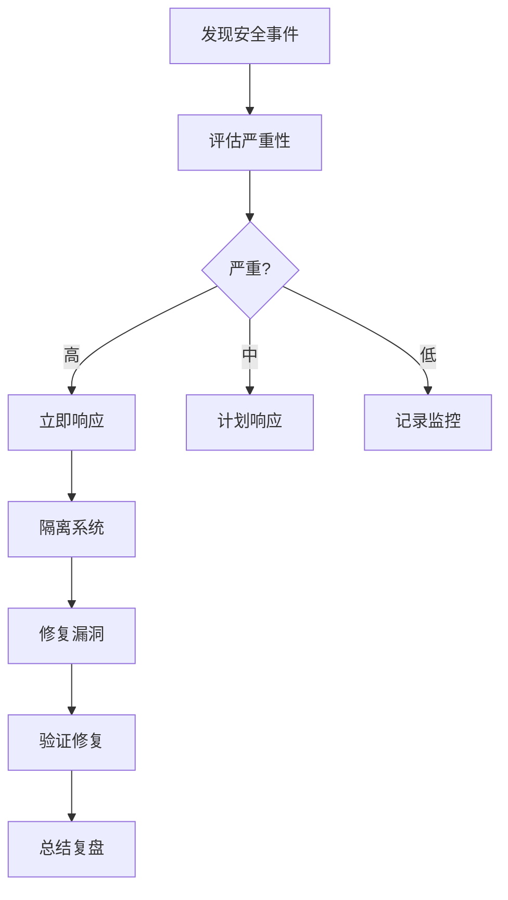

# 模块：安全检查与最佳实践

## OWASP Top 10 防护

### 1. 注入攻击防护
```javascript
// ❌ 危险：SQL注入风险
const query = `SELECT * FROM users WHERE id = ${userId}`;

// ✅ 安全：参数化查询
const query = 'SELECT * FROM users WHERE id = ?';
db.query(query, [userId]);

// ✅ 使用ORM
const user = await User.findOne({ where: { id: userId } });
```

### 2. 身份认证失效防护
```javascript
// 密码策略
const passwordPolicy = {
  minLength: 12,
  requireUppercase: true,
  requireLowercase: true,
  requireNumbers: true,
  requireSpecialChars: true,
  maxAge: 90, // 天
  history: 5, // 不能使用最近5个密码
};

// 会话管理
const sessionConfig = {
  secret: process.env.SESSION_SECRET,
  resave: false,
  saveUninitialized: false,
  cookie: {
    secure: true, // HTTPS only
    httpOnly: true, // 防XSS
    maxAge: 1000 * 60 * 30, // 30分钟
    sameSite: 'strict' // CSRF防护
  }
};
```

### 3. 敏感数据泄露防护
```javascript
// 加密存储
import bcrypt from 'bcrypt';

// 密码加密
const hashedPassword = await bcrypt.hash(password, 12);

// 密码验证
const isValid = await bcrypt.compare(password, hashedPassword);

// 敏感数据加密
import crypto from 'crypto';

function encrypt(text) {
  const cipher = crypto.createCipheriv(
    'aes-256-gcm',
    Buffer.from(process.env.ENCRYPTION_KEY, 'hex'),
    iv
  );
  // ... 加密逻辑
}
```

### 4. XML外部实体(XXE)防护
```javascript
// 禁用外部实体
const parser = new DOMParser();
const doc = parser.parseFromString(xmlString, 'text/xml', {
  resolve_externals: false,
  load_dtd: false,
  no_network: true
});
```

### 5. 访问控制失效防护
```javascript
// 基于角色的访问控制(RBAC)
function authorize(roles = []) {
  return (req, res, next) => {
    if (!req.user) {
      return res.status(401).json({ error: 'Unauthorized' });
    }

    if (roles.length && !roles.includes(req.user.role)) {
      return res.status(403).json({ error: 'Forbidden' });
    }

    next();
  };
}

// 使用
app.get('/admin', authorize(['admin']), adminController);
app.get('/user', authorize(['user', 'admin']), userController);
```

### 6. 安全配置错误防护
```javascript
// 安全头配置
import helmet from 'helmet';

app.use(helmet({
  contentSecurityPolicy: {
    directives: {
      defaultSrc: ["'self'"],
      styleSrc: ["'self'", "'unsafe-inline'"],
      scriptSrc: ["'self'"],
      imgSrc: ["'self'", "data:", "https:"],
    },
  },
  hsts: {
    maxAge: 31536000,
    includeSubDomains: true,
    preload: true
  }
}));
```

### 7. XSS防护
```javascript
// 输入净化
import DOMPurify from 'dompurify';

const clean = DOMPurify.sanitize(dirty);

// React中自动转义
function Component({ userInput }) {
  return <div>{userInput}</div>; // 自动转义
}

// 危险操作需谨慎
function DangerousComponent({ html }) {
  // ⚠️ 只在确认安全时使用
  return <div dangerouslySetInnerHTML={{ __html: sanitize(html) }} />;
}
```

### 8. 反序列化漏洞防护
```javascript
// 使用JSON schema验证
import Ajv from 'ajv';

const schema = {
  type: 'object',
  properties: {
    name: { type: 'string', maxLength: 100 },
    age: { type: 'number', minimum: 0, maximum: 150 }
  },
  required: ['name'],
  additionalProperties: false
};

const validate = ajv.compile(schema);
if (!validate(data)) {
  throw new Error('Invalid data');
}
```

### 9. 使用含有已知漏洞的组件
```javascript
// package.json
{
  "scripts": {
    "audit": "npm audit",
    "audit:fix": "npm audit fix",
    "check:updates": "npm-check-updates"
  }
}

// 自动化安全扫描
// .github/workflows/security.yml
name: Security Scan
on: [push]
jobs:
  security:
    runs-on: ubuntu-latest
    steps:
      - uses: actions/checkout@v2
      - run: npm audit --audit-level=moderate
```

### 10. 日志和监控不足
```javascript
// 安全日志记录
class SecurityLogger {
  logAuthFailure(username, ip) {
    logger.warn('Authentication failure', {
      username,
      ip,
      timestamp: new Date(),
      event: 'AUTH_FAILURE'
    });
  }

  logSuspiciousActivity(userId, action, details) {
    logger.error('Suspicious activity detected', {
      userId,
      action,
      details,
      timestamp: new Date(),
      event: 'SUSPICIOUS_ACTIVITY'
    });
  }
}
```

## 输入验证

### 验证策略
```javascript
// 白名单验证
function validateUsername(username) {
  const pattern = /^[a-zA-Z0-9_-]{3,20}$/;
  if (!pattern.test(username)) {
    throw new Error('Invalid username format');
  }
  return username;
}

// 类型验证
function validateAge(age) {
  const parsed = parseInt(age, 10);
  if (isNaN(parsed) || parsed < 0 || parsed > 150) {
    throw new Error('Invalid age');
  }
  return parsed;
}

// 使用验证库
import * as yup from 'yup';

const userSchema = yup.object({
  name: yup.string().required().min(2).max(50),
  email: yup.string().email().required(),
  age: yup.number().positive().integer().max(150)
});

await userSchema.validate(userData);
```

## API安全

### 速率限制
```javascript
import rateLimit from 'express-rate-limit';

const limiter = rateLimit({
  windowMs: 15 * 60 * 1000, // 15分钟
  max: 100, // 最大请求数
  message: 'Too many requests',
  standardHeaders: true,
  legacyHeaders: false,
});

// 登录接口特殊限制
const loginLimiter = rateLimit({
  windowMs: 15 * 60 * 1000,
  max: 5,
  skipSuccessfulRequests: true
});

app.use('/api/', limiter);
app.post('/api/login', loginLimiter, loginController);
```

### API密钥管理
```javascript
// 环境变量
require('dotenv').config();

// 密钥轮换
class ApiKeyManager {
  async rotateKey(clientId) {
    const newKey = crypto.randomBytes(32).toString('hex');
    await this.saveKey(clientId, newKey);
    await this.scheduleOldKeyDeletion(clientId);
    return newKey;
  }

  validateKey(key) {
    // 检查密钥格式
    if (!/^[a-f0-9]{64}$/.test(key)) {
      return false;
    }
    // 检查密钥是否存在且未过期
    return this.isKeyValid(key);
  }
}
```

## 数据保护

### 加密传输
```javascript
// 强制HTTPS
app.use((req, res, next) => {
  if (req.header('x-forwarded-proto') !== 'https') {
    return res.redirect(`https://${req.header('host')}${req.url}`);
  }
  next();
});

// TLS配置
const https = require('https');
const fs = require('fs');

const options = {
  key: fs.readFileSync('private-key.pem'),
  cert: fs.readFileSync('certificate.pem'),
  // 只允许TLS 1.2+
  secureProtocol: 'TLSv1_2_method'
};

https.createServer(options, app).listen(443);
```

### 数据脱敏
```javascript
// 日志脱敏
function maskSensitiveData(data) {
  const masked = { ...data };

  // 脱敏邮箱
  if (masked.email) {
    masked.email = masked.email.replace(/(.{2})(.*)(@.*)/, '$1***$3');
  }

  // 脱敏手机号
  if (masked.phone) {
    masked.phone = masked.phone.replace(/(\d{3})\d{4}(\d{4})/, '$1****$2');
  }

  // 移除密码
  delete masked.password;

  return masked;
}
```

## 安全检查清单

### 开发阶段
- [ ] 输入验证实施
- [ ] 输出编码正确
- [ ] 认证机制安全
- [ ] 会话管理完善
- [ ] 访问控制到位
- [ ] 敏感数据加密
- [ ] 错误处理安全
- [ ] 日志记录合规

### 部署阶段
- [ ] HTTPS配置
- [ ] 安全头设置
- [ ] 密钥管理
- [ ] 防火墙规则
- [ ] DDoS防护
- [ ] 备份策略
- [ ] 监控告警
- [ ] 应急预案

### 代码审查重点
```markdown
## 安全代码审查检查点

### 认证和授权
- [ ] 密码强度要求
- [ ] 多因素认证
- [ ] 会话超时设置
- [ ] 权限最小化原则

### 数据验证
- [ ] 所有输入都验证
- [ ] 白名单验证优先
- [ ] 文件上传限制
- [ ] SQL注入防护

### 错误处理
- [ ] 不泄露敏感信息
- [ ] 通用错误消息
- [ ] 详细日志记录
- [ ] 异常捕获完整
```

## 安全工具集成

### 静态代码分析
```json
{
  "scripts": {
    "security:scan": "npm audit && snyk test",
    "lint:security": "eslint --plugin security .",
    "check:secrets": "truffleHog --regex --entropy=False ."
  }
}
```

### 动态安全测试
```yaml
# OWASP ZAP 扫描
zap_scan:
  stage: security
  script:
    - docker run -v $(pwd):/zap/wrk/:rw \
      -t owasp/zap2docker-stable zap-baseline.py \
      -t https://example.com -g gen.conf -r report.html
```

## 事件响应

### 安全事件处理流程


### 应急响应计划
1. **检测**：监控异常活动
2. **分析**：确定影响范围
3. **遏制**：防止进一步损害
4. **根除**：移除威胁源
5. **恢复**：恢复正常运营
6. **总结**：事后分析改进

---
**模块类型**：安全防护
**适用场景**：安全审计、代码审查、漏洞修复、合规检查
**配合模块**：code-review, testing