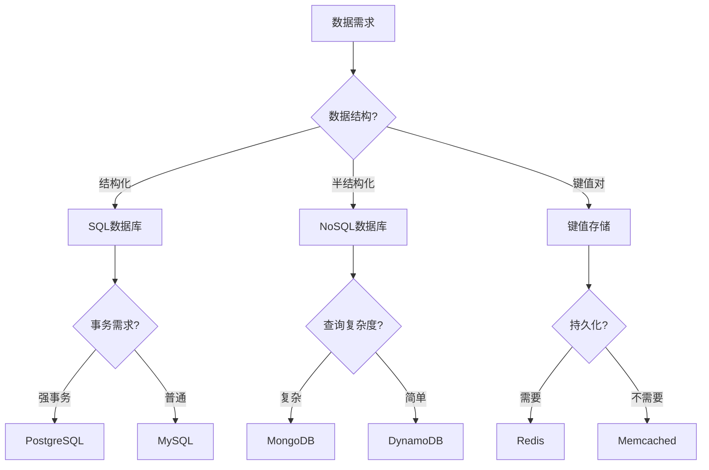

# 模块：技术选型决策指南

## 技术选型原则

### 核心考虑因素
```yaml
decision_factors:
  business:           # 业务因素
    - 需求匹配度
    - 成本效益
    - 上市时间
    - 扩展性需求

  technical:          # 技术因素
    - 性能要求
    - 可靠性
    - 安全性
    - 可维护性

  team:              # 团队因素
    - 技术栈熟悉度
    - 学习成本
    - 招聘难度
    - 知识传承

  ecosystem:         # 生态因素
    - 社区活跃度
    - 文档完善度
    - 第三方支持
    - 长期支持(LTS)
```

## 前端技术选型

### 框架选择
| 场景 | React | Vue | Angular | Svelte |
|------|-------|-----|---------|--------|
| **企业应用** | ⭐⭐⭐⭐⭐ | ⭐⭐⭐⭐ | ⭐⭐⭐⭐⭐ | ⭐⭐⭐ |
| **快速原型** | ⭐⭐⭐ | ⭐⭐⭐⭐⭐ | ⭐⭐ | ⭐⭐⭐⭐ |
| **性能要求高** | ⭐⭐⭐⭐ | ⭐⭐⭐⭐ | ⭐⭐⭐ | ⭐⭐⭐⭐⭐ |
| **SEO重要** | ⭐⭐⭐(Next.js) | ⭐⭐⭐⭐(Nuxt) | ⭐⭐⭐ | ⭐⭐⭐⭐(SvelteKit) |
| **团队大** | ⭐⭐⭐⭐⭐ | ⭐⭐⭐ | ⭐⭐⭐⭐⭐ | ⭐⭐ |

### 状态管理
```javascript
// 决策树
function chooseStateManagement(appSize, complexity) {
  if (appSize === 'small') {
    if (complexity === 'simple') {
      return 'Context API / Composition API';
    }
    return 'Zustand / Pinia';
  }

  if (appSize === 'medium') {
    if (complexity === 'moderate') {
      return 'Redux Toolkit / Vuex';
    }
    return 'MobX / Valtio';
  }

  if (appSize === 'large') {
    if (complexity === 'complex') {
      return 'Redux Toolkit + RTK Query';
    }
    return 'Recoil / Jotai';
  }
}

// 状态管理对比
const stateManagementComparison = {
  'Redux Toolkit': {
    pros: ['可预测', '时间旅行', '生态丰富'],
    cons: ['样板代码多', '学习曲线陡'],
    useCase: '大型应用，需要严格状态管理'
  },
  'Zustand': {
    pros: ['简单', '轻量', 'TypeScript友好'],
    cons: ['生态较小', '功能简单'],
    useCase: '中小型应用，快速开发'
  },
  'MobX': {
    pros: ['响应式', '少样板代码', '面向对象'],
    cons: ['魔法太多', '调试困难'],
    useCase: '复杂状态逻辑，面向对象背景'
  }
};
```

### CSS方案
```yaml
css_solutions:
  css_modules:
    pros: [局部作用域, 简单, 无运行时]
    cons: [类名冗长, 动态样式困难]
    适用: 传统项目迁移

  styled_components:
    pros: [CSS-in-JS, 动态样式, 主题支持]
    cons: [运行时开销, 包体积增加]
    适用: React项目

  tailwind:
    pros: [原子化, 快速开发, 一致性]
    cons: [类名冗长, 学习成本]
    适用: 快速原型, 设计系统

  sass_scss:
    pros: [功能丰富, 成熟, 变量混入]
    cons: [需要编译, 全局污染]
    适用: 大型传统项目
```

## 后端技术选型

### 语言选择
```markdown
## 编程语言决策矩阵

### Node.js/JavaScript
✅ **优势**
- 前后端统一语言
- 异步I/O性能好
- npm生态丰富
- 快速开发

❌ **劣势**
- CPU密集型任务弱
- 类型安全性差(可用TS缓解)

📦 **适用场景**
- 实时应用(WebSocket)
- RESTful API
- 微服务
- Serverless

### Python
✅ **优势**
- 语法简洁
- AI/ML生态强大
- 科学计算
- 快速原型

❌ **劣势**
- GIL限制并发
- 性能相对较慢

📦 **适用场景**
- 数据分析
- 机器学习
- 爬虫
- 自动化脚本

### Go
✅ **优势**
- 高性能
- 并发优秀
- 部署简单
- 内存占用小

❌ **劣势**
- 生态相对较小
- 泛型支持较新

📦 **适用场景**
- 微服务
- 云原生应用
- 高并发系统
- DevOps工具

### Java
✅ **优势**
- 生态成熟
- 企业级支持
- 性能优秀
- 强类型

❌ **劣势**
- 启动慢
- 内存占用大
- 样板代码多

📦 **适用场景**
- 企业应用
- 大型系统
- Android开发
```

### 框架选择
```javascript
// Web框架决策
const webFrameworks = {
  // Node.js
  'Express': {
    maturity: '成熟',
    learning: '简单',
    performance: '良好',
    适用: '小到中型API, 灵活定制'
  },
  'NestJS': {
    maturity: '成熟',
    learning: '中等',
    performance: '良好',
    适用: '企业级应用, Angular风格'
  },
  'Fastify': {
    maturity: '较新',
    learning: '简单',
    performance: '优秀',
    适用: '高性能API, 微服务'
  },

  // Python
  'Django': {
    maturity: '非常成熟',
    learning: '中等',
    performance: '良好',
    适用: '全栈应用, 快速开发'
  },
  'FastAPI': {
    maturity: '较新',
    learning: '简单',
    performance: '优秀',
    适用: '现代API, 自动文档'
  },

  // Go
  'Gin': {
    maturity: '成熟',
    learning: '简单',
    performance: '极佳',
    适用: '高性能API, 微服务'
  },
  'Fiber': {
    maturity: '较新',
    learning: '简单',
    performance: '极佳',
    适用: 'Express风格, 高性能'
  }
};
```

## 数据库选型

### 数据库类型选择


### 数据库对比
| 数据库 | 类型 | 适用场景 | 优势 | 劣势 |
|--------|------|----------|------|------|
| **PostgreSQL** | 关系型 | 复杂查询, ACID | 功能丰富, 扩展性强 | 配置复杂 |
| **MySQL** | 关系型 | Web应用, 读多写少 | 成熟, 社区大 | 高级功能少 |
| **MongoDB** | 文档型 | 灵活schema, 快速迭代 | 开发快, 水平扩展 | 事务支持弱 |
| **Redis** | 键值型 | 缓存, 会话, 队列 | 极快, 数据结构丰富 | 内存限制 |
| **Elasticsearch** | 搜索引擎 | 全文搜索, 日志分析 | 搜索强大, 分析能力 | 资源消耗大 |
| **Cassandra** | 列族 | 时序数据, 大数据 | 高可用, 线性扩展 | 查询受限 |

## 架构模式选型

### 应用架构
```yaml
architectures:
  monolithic:
    优点:
      - 开发简单
      - 调试容易
      - 部署简单
    缺点:
      - 扩展困难
      - 技术栈单一
      - 故障影响大
    适用:
      - 小型应用
      - 快速MVP
      - 团队小

  microservices:
    优点:
      - 独立部署
      - 技术栈灵活
      - 故障隔离
    缺点:
      - 复杂度高
      - 网络开销
      - 数据一致性难
    适用:
      - 大型系统
      - 团队独立
      - 高可用要求

  serverless:
    优点:
      - 无需管理服务器
      - 自动扩展
      - 按需付费
    缺点:
      - 冷启动
      - vendor lock-in
      - 调试困难
    适用:
      - 事件驱动
      - 不规则流量
      - 快速原型
```

### 部署方案
```javascript
// 部署方案决策
function chooseDeployment(requirements) {
  const { scale, complexity, budget, team } = requirements;

  if (scale === 'small' && budget === 'low') {
    return {
      solution: 'Vercel/Netlify',
      reason: '免费额度, 自动部署'
    };
  }

  if (scale === 'medium' && complexity === 'moderate') {
    return {
      solution: 'Docker + Cloud Run/ECS',
      reason: '容器化, 自动扩展'
    };
  }

  if (scale === 'large' && complexity === 'high') {
    return {
      solution: 'Kubernetes',
      reason: '完全控制, 复杂编排'
    };
  }

  if (requirements.includes('multi-cloud')) {
    return {
      solution: 'Terraform + K8s',
      reason: '基础设施即代码, 云中立'
    };
  }
}
```

## 技术债务评估

### 技术债务矩阵
```markdown
## 技术债务分类

### 🔴 高风险债务
- 安全漏洞
- 数据一致性问题
- 关键依赖过时
- 无测试覆盖

### 🟡 中风险债务
- 性能瓶颈
- 代码重复
- 文档缺失
- 架构耦合

### 🟢 低风险债务
- 代码风格不一致
- 次要依赖更新
- 优化机会
- 重构需求
```

### 偿还策略
```javascript
// 技术债务偿还优先级
const debtPriorityMatrix = {
  'critical_security': {
    priority: 'P0',
    action: '立即修复',
    timeline: '24小时内'
  },
  'data_corruption_risk': {
    priority: 'P0',
    action: '紧急修复',
    timeline: '本迭代内'
  },
  'performance_degradation': {
    priority: 'P1',
    action: '计划修复',
    timeline: '下个迭代'
  },
  'code_quality': {
    priority: 'P2',
    action: '持续改进',
    timeline: '按20%时间分配'
  }
};
```

## 技术雷达

### 技术采纳阶段
```yaml
technology_radar:
  adopt:  # 采纳：推荐使用
    - React/Vue
    - TypeScript
    - Docker
    - PostgreSQL
    - GitHub Actions

  trial:  # 试验：小范围试用
    - Deno
    - Bun
    - SolidJS
    - Temporal
    - WebAssembly

  assess: # 评估：值得关注
    - Blockchain
    - Web3
    - Quantum Computing
    - Edge Computing

  hold:   # 暂缓：避免使用
    - AngularJS
    - CoffeeScript
    - Bower
    - Grunt
```

## 迁移策略

### 技术栈迁移
```markdown
## 渐进式迁移策略

### 第一阶段：评估
1. 现状分析
2. 目标确定
3. 风险评估
4. ROI计算

### 第二阶段：试点
1. 选择低风险模块
2. 并行运行
3. 性能对比
4. 团队培训

### 第三阶段：推广
1. 制定迁移计划
2. 分批迁移
3. 持续监控
4. 回滚预案

### 第四阶段：完成
1. 全面切换
2. 旧系统下线
3. 文档更新
4. 经验总结
```

## 决策文档模板

```markdown
# 技术选型决策：[技术名称]

## 背景
[为什么需要做这个决策]

## 需求
- 功能需求：
- 非功能需求：
- 约束条件：

## 方案对比
| 方案 | 优点 | 缺点 | 风险 | 成本 |
|------|------|------|------|------|
| 方案A | | | | |
| 方案B | | | | |
| 方案C | | | | |

## 评分矩阵
| 标准 | 权重 | 方案A | 方案B | 方案C |
|------|------|-------|-------|-------|
| 性能 | 30% | 8 | 7 | 9 |
| 成本 | 25% | 7 | 9 | 6 |
| 维护 | 25% | 8 | 7 | 7 |
| 生态 | 20% | 9 | 6 | 7 |

## 决策
选择：[方案X]
原因：[详细说明]

## 风险与缓解
- 风险1：[描述] → 缓解：[措施]
- 风险2：[描述] → 缓解：[措施]

## 实施计划
1. 阶段1：[时间] [内容]
2. 阶段2：[时间] [内容]
3. 阶段3：[时间] [内容]

## 成功标准
- [ ] 标准1
- [ ] 标准2
- [ ] 标准3
```

---
**模块类型**：架构决策
**适用场景**：技术选型、架构设计、技术债务管理
**配合模块**：project-templates, performance