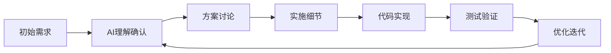
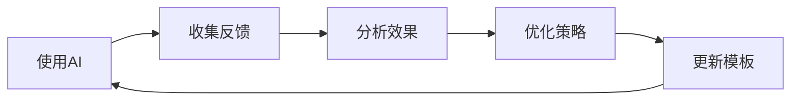

# 模块：AI协作最佳实践

## 高效提示工程

### 提示结构模板
```markdown
## 基础模板
[角色定义] + [背景信息] + [具体任务] + [约束条件] + [输出格式]

## 示例
角色：你是一位资深的React开发专家
背景：我们正在开发一个电商网站的购物车功能
任务：实现一个具有增删改功能的购物车组件
约束：使用TypeScript, Redux Toolkit, 遵循SOLID原则
输出：提供完整的组件代码和单元测试
```

### 任务描述最佳实践
```yaml
effective_prompts:
  明确性:
    ❌差: "帮我优化代码"
    ✅好: "优化这个React组件的渲染性能，减少不必要的重渲染"

  具体性:
    ❌差: "写一个登录功能"
    ✅好: "实现JWT认证的登录功能，包含邮箱验证、密码加密、session管理"

  上下文:
    ❌差: "修复这个bug"
    ✅好: "修复用户点击提交按钮后页面无响应的bug，错误出现在handleSubmit函数"

  期望输出:
    ❌差: "给我解决方案"
    ✅好: "提供3种解决方案，包含优缺点对比和代码示例"
```

### 迭代式沟通


## 任务分解策略

### 复杂任务拆分
```javascript
// 任务分解示例
const complexTask = "构建一个完整的用户管理系统";

const subtasks = [
  {
    phase: "需求分析",
    tasks: [
      "定义用户角色和权限",
      "设计数据模型",
      "确定API接口"
    ],
    ai_support: "帮助设计RBAC权限模型"
  },
  {
    phase: "后端开发",
    tasks: [
      "实现认证中间件",
      "开发CRUD API",
      "添加数据验证"
    ],
    ai_support: "生成API代码和测试用例"
  },
  {
    phase: "前端开发",
    tasks: [
      "创建用户界面",
      "实现表单验证",
      "集成API调用"
    ],
    ai_support: "创建React组件和状态管理"
  },
  {
    phase: "测试部署",
    tasks: [
      "编写测试用例",
      "性能优化",
      "部署配置"
    ],
    ai_support: "生成测试代码和部署脚本"
  }
];
```

### 优先级管理
```markdown
## 任务优先级框架

### 🔴 紧急且重要
- 生产环境bug修复
- 安全漏洞修补
- 数据丢失问题

**AI协作方式**：立即响应，提供快速解决方案

### 🟡 重要不紧急
- 架构优化
- 性能提升
- 技术债务偿还

**AI协作方式**：深入分析，提供多种方案对比

### 🟢 紧急不重要
- 临时需求
- 快速原型
- 演示准备

**AI协作方式**：快速实现，后续优化

### ⚪ 不紧急不重要
- 代码美化
- 文档补充
- 知识学习

**AI协作方式**：批量处理，自动化完成
```

## 代码协作模式

### 结对编程模式
```markdown
## AI结对编程流程

1. **Driver（你）编写代码**
   - 实现核心逻辑
   - 处理业务需求

2. **Navigator（AI）提供支持**
   - 代码审查和建议
   - 发现潜在问题
   - 提供优化方案

3. **角色切换**
   - AI生成代码框架
   - 你完善细节和定制
```

### 代码审查协作
```javascript
// AI代码审查检查点
const codeReviewChecklist = {
  functionality: [
    "逻辑是否正确",
    "边界条件处理",
    "错误处理完整性"
  ],
  quality: [
    "遵循SOLID原则",
    "代码可读性",
    "无重复代码"
  ],
  performance: [
    "时间复杂度",
    "空间复杂度",
    "数据库查询优化"
  ],
  security: [
    "输入验证",
    "SQL注入防护",
    "XSS防护"
  ],
  testing: [
    "测试覆盖率",
    "边界测试",
    "异常测试"
  ]
};

// 使用示例
/*
User: 请审查这段代码
AI: 我将从以下几个方面审查：
1. ✅ 功能性：逻辑正确，但缺少空值处理
2. ⚠️ 性能：存在N+1查询问题
3. 🔴 安全性：未验证用户输入
[提供具体改进建议]
*/
```

### 测试驱动协作
```markdown
## TDD协作流程

### Step 1: AI生成测试
```javascript
// AI生成的测试用例
describe('UserService', () => {
  it('should create user with valid data', () => {
    // 测试代码
  });

  it('should reject invalid email', () => {
    // 测试代码
  });
});
```

### Step 2: 你实现功能
```javascript
// 你的实现代码
class UserService {
  createUser(data) {
    // 实现逻辑
  }
}
```

### Step 3: AI优化建议
- 代码重构建议
- 性能优化点
- 边界条件补充
```

## 知识管理

### 学习路径定制
```yaml
learning_paths:
  frontend_mastery:
    beginner:
      - HTML/CSS基础
      - JavaScript核心
      - React入门
    intermediate:
      - 状态管理
      - 性能优化
      - 测试策略
    advanced:
      - 微前端架构
      - SSR/SSG
      - WebAssembly

  backend_expertise:
    beginner:
      - HTTP协议
      - RESTful API
      - 数据库基础
    intermediate:
      - 认证授权
      - 缓存策略
      - 消息队列
    advanced:
      - 分布式系统
      - 微服务架构
      - 事件驱动
```

### 问题解决模板
```markdown
## 问题解决协作模板

### 1. 问题定义
**症状**：[观察到的现象]
**影响**：[对系统的影响]
**频率**：[发生频率]

### 2. 根因分析
**可能原因**：
- 原因1：[描述]
- 原因2：[描述]
- 原因3：[描述]

### 3. 解决方案
**方案A**：[快速修复]
- 优点：
- 缺点：

**方案B**：[根本解决]
- 优点：
- 缺点：

### 4. 实施计划
1. [步骤1]
2. [步骤2]
3. [步骤3]

### 5. 验证方法
- [ ] 测试场景1
- [ ] 测试场景2
- [ ] 监控指标
```

## 自动化协作

### 代码生成模板
```javascript
// 配置驱动的代码生成
const codeGenConfig = {
  type: 'crud_api',
  model: 'User',
  fields: [
    { name: 'id', type: 'uuid', primary: true },
    { name: 'email', type: 'string', unique: true },
    { name: 'name', type: 'string', required: true }
  ],
  features: {
    authentication: true,
    validation: true,
    pagination: true,
    sorting: true,
    filtering: true
  }
};

// AI根据配置生成完整的CRUD API代码
/*
生成内容：
- 数据模型
- 验证规则
- API路由
- 控制器
- 服务层
- 测试用例
*/
```

### 文档自动生成
```markdown
## 自动文档类型

### API文档
- 从代码注释生成
- OpenAPI/Swagger规范
- 包含示例和测试

### 代码文档
- 函数说明
- 参数描述
- 返回值说明
- 使用示例

### 项目文档
- README.md
- CONTRIBUTING.md
- CHANGELOG.md
- Architecture.md
```

## 协作工作流

### Pull Request协作
```yaml
pr_workflow:
  step1_create:
    human: 创建PR并描述变更
    ai: 自动检查代码质量

  step2_review:
    ai: 提供代码审查建议
    human: 响应并修改

  step3_test:
    ai: 生成测试用例
    human: 确认测试覆盖

  step4_document:
    ai: 更新相关文档
    human: 审核文档

  step5_merge:
    human: 批准合并
    ai: 检查合并冲突
```

### 调试协作
```javascript
// 调试协作流程
const debuggingProcess = {
  identify: {
    human: "报告bug症状",
    ai: "分析可能原因"
  },

  reproduce: {
    human: "提供复现步骤",
    ai: "创建测试用例"
  },

  locate: {
    ai: "定位问题代码",
    human: "确认问题位置"
  },

  fix: {
    ai: "提供修复方案",
    human: "实施修复"
  },

  verify: {
    ai: "生成验证测试",
    human: "确认修复有效"
  }
};
```

## 最佳实践清单

### DO ✅
```markdown
- 提供清晰的上下文
- 分步骤描述复杂任务
- 给出具体的例子
- 说明预期输出格式
- 及时反馈和纠正
- 保存有用的对话
- 迭代优化提示
```

### DON'T ❌
```markdown
- 模糊不清的需求
- 一次要求太多
- 忽略AI的建议
- 不验证生成的代码
- 完全依赖AI决策
- 忽视安全建议
- 跳过测试步骤
```

## 效率提升技巧

### 批量操作
```javascript
// 批量任务处理
const batchTasks = [
  "为所有API端点添加认证中间件",
  "将所有console.log替换为logger",
  "为所有组件添加PropTypes",
  "生成所有模型的测试用例"
];

// AI可以并行处理这些任务
```

### 模板复用
```markdown
## 可复用的提示模板

### 代码优化模板
"优化以下代码的[性能/可读性/安全性]，
要求：[具体要求]，
保持：[不变的部分]，
输出：[期望格式]"

### bug修复模板
"修复问题：[问题描述]，
错误信息：[错误日志]，
环境：[运行环境]，
期望：[正确行为]"

### 功能实现模板
"实现功能：[功能名称]，
输入：[输入格式]，
处理：[业务逻辑]，
输出：[输出格式]，
约束：[限制条件]"
```

## 持续改进

### 反馈循环


### 效果度量
```yaml
metrics:
  productivity:
    - 代码生成速度
    - bug修复时间
    - 功能交付周期

  quality:
    - 代码质量评分
    - 测试覆盖率
    - bug密度

  learning:
    - 知识获取速度
    - 技能提升程度
    - 问题解决能力
```

---
**模块类型**：协作指南
**适用场景**：日常开发、问题解决、知识学习
**配合模块**：所有其他模块