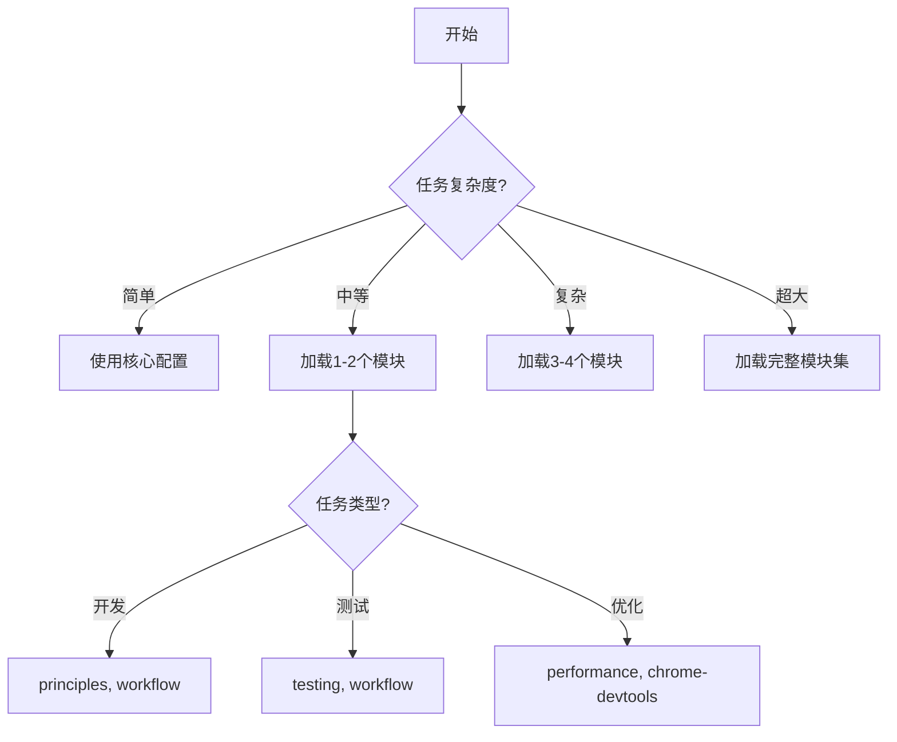

# 🚀 Claude 模块化配置 - 完整快速参考手册

## ⚡ 一分钟快速上手

### 1️⃣ 系统状态检查
```powershell
# 查看当前配置状态
.\switch-config.ps1 status
```

### 2️⃣ 切换配置系统
```powershell
# 切换到模块化系统（推荐）
.\switch-config.ps1 modular

# 切换回传统系统
.\switch-config.ps1 legacy
```

### 3️⃣ 初始化开发记录
```powershell
# 自动选择合适级别
.\claude-prompts\scripts\init-dev-logs.ps1

# 指定项目规模
.\claude-prompts\scripts\init-dev-logs.ps1 -ProjectSize medium -TeamSize 5
```

---

## 📦 模块系统操作

### 🎮 模块管理命令
```bash
/load module_name           # 加载单个模块
/load mod1, mod2, mod3      # 加载多个模块
/init project_type          # 初始化项目
/apply strategy             # 应用开发策略
/check checklist            # 执行检查清单
/devlog action              # 开发记录管理
```

### 📋 核心任务模块组合
| 任务类型 | 加载命令 | 包含功能 |
|----------|---------|----------|
| **基础开发** | `/load principles, workflow` | 编程原则+工作流程 |
| **测试驱动** | `/apply tdd` | TDD+测试策略 |
| **代码审查** | `/load principles, code-review` | 原则+审查标准 |
| **性能优化** | `/load performance` | 性能指标+分析工具 |
| **新项目** | `/init react-app` | 项目模板+记录系统 |
| **安全审计** | `/check security` | 安全检查+代码审查 |
| **文档查询** | `/load mcp-services` | MCP服务配置 |
| **大型任务** | `/load task-management, dev-logs` | 任务分解+进度追踪 |
| **全栈开发** | `/load tech-stack, project-templates` | 技术选型+项目模板 |
| **AI协作** | `/load ai-collaboration, workflow` | 协作指南+工作流程 |

### 🗂️ 完整模块列表
| 模块名 | 文件路径 | 用途 |
|--------|----------|------|
| **principles** | `01-principles.md` | 详细编程原则（SOLID, DRY等） |
| **workflow** | `02-workflow.md` | 标准工作流程（5阶段） |
| **task-management** | `03-task-management.md` | 大任务处理模式 |
| **mcp-services** | `04-mcp-services.md` | MCP服务详细配置 |
| **dev-logs** | `05-dev-logs.md` | AI开发记录系统 |
| **testing** | `06-testing.md` | 测试规范和策略 |
| **security** | `07-security.md` | 安全检查清单 |
| **performance** | `08-performance.md` | 性能优化指南 |
| **code-review** | `09-code-review.md` | 代码审查标准 |
| **tech-stack** | `10-tech-stack.md` | 技术选型决策 |
| **ai-collaboration** | `11-ai-collaboration.md` | AI协作最佳实践 |
| **project-templates** | `12-project-templates.md` | 项目初始化模板 |

### 📖 模块加载器详细规范
详见：`module-loader.md`（包含依赖关系、智能加载规则、缓存策略等）

---

## 🚀 AI 开发记录系统

### 📝 快速初始化命令

#### 基础命令
```powershell
# 1. 最简单 - 自动选择
.\claude-prompts\scripts\init-dev-logs.ps1

# 2. 小型个人项目
.\claude-prompts\scripts\init-dev-logs.ps1 -Level minimal

# 3. 中型团队项目（5人团队）
.\claude-prompts\scripts\init-dev-logs.ps1 -ProjectSize medium -TeamSize 5

# 4. 大型企业项目（完整功能）
.\claude-prompts\scripts\init-dev-logs.ps1 -Level enterprise -WithDashboard -WithGitHooks

# 5. 重新初始化（覆盖现有）
.\claude-prompts\scripts\init-dev-logs.ps1 -Force
```

### 📊 参数速查表

| 参数 | 可选值 | 默认值 | 说明 |
|-----|--------|--------|------|
| **-Level** | minimal, standard, enterprise, auto | auto | 记录系统级别 |
| **-ProjectSize** | small, medium, large | medium | 项目规模 |
| **-TeamSize** | 任意数字 | 1 | 团队人数 |
| **-WithDashboard** | （开关） | false | 启用可视化仪表板 |
| **-WithGitHooks** | （开关） | false | 启用Git集成 |
| **-Force** | （开关） | false | 强制重新初始化 |

### 🎯 自动级别选择规则

```
if (ProjectSize == "small" && TeamSize <= 2) → minimal
else if (ProjectSize == "medium" || TeamSize <= 5) → standard
else → enterprise
```

### 📁 目录结构对比

#### Minimal（最小化）
```
.ai-dev-logs/
├── README.md
├── today.md
└── archive/
```

#### Standard（标准）
```
.ai-dev-logs/
├── README.md
├── index.md
├── daily/
├── features/
├── issues/
├── metrics/
├── templates/
├── commits/
└── sessions/
```

#### Enterprise（企业级）
```
.ai-dev-logs/
├── README.md
├── management/
│   ├── roadmap.md
│   ├── milestones/
│   └── reports/
├── development/
│   ├── daily/
│   ├── weekly/
│   └── sprints/
├── architecture/
│   ├── decisions/
│   │   └── ADR-001.md
│   ├── diagrams/
│   └── dependencies/
├── quality/
│   ├── code-reviews/
│   ├── security-audits/
│   └── performance-tests/
├── knowledge/
│   ├── lessons-learned.md
│   ├── best-practices.md
│   └── troubleshooting.md
├── dashboard/
│   └── index.html
└── [其他标准目录]
```

### ✨ 特性对比

| 特性 | Minimal | Standard | Enterprise |
|------|---------|----------|------------|
| 每日记录 | ✓ | ✓ | ✓ |
| 任务模板 | - | ✓ | ✓ |
| 功能模板 | - | ✓ | ✓ |
| ADR模板 | - | - | ✓ |
| 会话记录 | - | ✓ | ✓ |
| 仪表板 | - | 可选 | 可选 |
| Git集成 | - | 可选 | 可选 |
| 知识管理 | - | - | ✓ |
| 架构决策 | - | - | ✓ |
| 质量追踪 | - | - | ✓ |
| 项目路线图 | - | - | ✓ |

---

## 💡 使用场景示例

### 📝 对话示例

#### 示例1: 简单任务（无需加载）
```
用户: 解释一下什么是闭包
AI: [直接回答，使用核心配置]
```

#### 示例2: 代码重构（加载原则）
```
用户: 重构这个用户服务类
AI: 我来帮您重构，先加载相关模块。
/load principles, testing
[应用SOLID原则进行重构]
```

#### 示例3: 新项目（完整加载）
```
用户: 创建一个新的电商网站
AI: 这是一个大型项目，让我加载必要的模块。
/init fullstack
/load workflow, dev-logs, task-management
[系统化地创建项目]
```

### 🎯 场景化配置建议

#### 场景1: 个人学习项目
```powershell
.\claude-prompts\scripts\init-dev-logs.ps1 -Level minimal
```
加载模块：`/load principles`

#### 场景2: 开源项目（3人）
```powershell
.\claude-prompts\scripts\init-dev-logs.ps1 -ProjectSize medium -TeamSize 3 -WithDashboard
```
加载模块：`/load workflow, testing, dev-logs`

#### 场景3: 创业公司产品（8人）
```powershell
.\claude-prompts\scripts\init-dev-logs.ps1 -ProjectSize large -TeamSize 8 -WithDashboard -WithGitHooks
```
加载模块：`/load workflow, task-management, dev-logs, tech-stack`

#### 场景4: 企业级项目（20+人）
```powershell
.\claude-prompts\scripts\init-dev-logs.ps1 -Level enterprise -WithDashboard -WithGitHooks
```
加载模块：`/load workflow, task-management, dev-logs, security, performance`

---

## 🛠️ 项目初始化

### 项目模板命令
```bash
/init react-app            # React项目
/init nodejs-api           # Node.js API
/init fullstack            # 全栈项目
/init microservices        # 微服务架构
```

### 策略应用
```bash
/apply tdd                 # 应用TDD策略
/apply security-first      # 安全优先策略
/apply performance         # 性能优化策略
/apply clean-architecture  # 清洁架构策略
```

---

## 🗂️ 文件位置速查

```
├── .claude/
│   ├── CLAUDE_CORE.md      # 核心配置（精简版）
│   ├── CLAUDE.md           # 传统配置（向后兼容）
│   ├── claude-prompts/            # 模块目录
│   │   ├── *.md           # 各模块文件
│   │   ├── scripts/       # 初始化脚本
│   │   └── QUICK_REFERENCE.md  # 本文件
│   ├── project.md         # 项目特定配置
│   └── local.md           # 本地覆盖配置
└── .ai-dev-logs/          # AI开发记录目录
```

---

## ✅ 最佳实践

### 👍 推荐做法
1. **简单任务用核心配置** - 不要过度加载
2. **复杂任务按需加载** - 只加载必要模块
3. **为项目创建专属配置** - 使用 `.claude/project.md`
4. **定期查看开发记录** - 跟踪进度和决策
5. **使用模板初始化** - 确保一致性
6. **渐进式加载** - 从少到多，按需增加

### ❌ 避免做法
1. **一次加载所有模块** - 影响性能
2. **忽略项目特定需求** - 缺乏针对性
3. **不记录重要决策** - 丢失上下文
4. **混用新旧系统** - 造成混乱
5. **跳过初始化步骤** - 缺少必要结构
6. **修改核心配置** - 应使用 local.md 覆盖

---

## 🔍 问题排查

| 问题 | 解决方法 |
|------|----------|
| 模块加载失败 | 检查模块名是否正确，查看 `claude-prompts/` 目录 |
| 配置未生效 | 运行 `.\switch-config.ps1 status` 检查状态 |
| 找不到模块 | 确认 `claude-prompts/` 目录存在且文件完整 |
| 性能变慢 | 只加载必要模块，重启会话清除已加载模块 |
| 初始化失败 | 检查 PowerShell 执行策略，使用管理员权限 |
| Git hooks 不工作 | 确认 `-WithGitHooks` 参数，检查 `.git/hooks/` |

---

## 📊 性能对比

| 场景 | 传统系统 | 模块化系统 | 提升 |
|------|---------|-----------|------|
| 启动时间 | 2000ms | 200ms | 10x ⬆️ |
| 内存占用 | 50MB | 10MB | 5x ⬇️ |
| 响应速度 | 正常 | 快速 | 2x ⬆️ |
| 配置灵活性 | 低 | 高 | 5x ⬆️ |

---

## 🎯 选择指南



---

## 🚀 初始化后的下一步

1. **查看文档**: 打开 `.ai-dev-logs/README.md`
2. **查看模板**: 浏览 `.ai-dev-logs/templates/` 目录
3. **创建首个任务**: 使用 `task.md` 模板
4. **查看仪表板**: 打开 `.ai-dev-logs/dashboard/index.html`（如果启用）
5. **配置Git Hooks**: 检查 `.git/hooks/pre-commit`（如果启用）
6. **开始记录**: 在 `.ai-dev-logs/daily/` 创建今日记录

---

## 📚 相关文档

- **详细配置**: `README_MODULAR.md` - 模块化系统详细说明
- **核心配置**: `CLAUDE_CORE.md` - 精简核心配置
- **模块目录**: `claude-prompts/` - 所有可用模块
- **配置示例**: `claude-prompts/12-project-templates.md` - 项目模板
- **初始化脚本**: `claude-prompts/scripts/` - 自动化脚本

---

## 🔄 常见问题FAQ

### Q: 如何升级记录级别？
```powershell
# 从 minimal 升级到 standard
.\claude-prompts\scripts\init-dev-logs.ps1 -Level standard -Force

# 从 standard 升级到 enterprise
.\claude-prompts\scripts\init-dev-logs.ps1 -Level enterprise -Force
```

### Q: 如何只添加仪表板？
```powershell
# 在现有基础上添加仪表板
.\claude-prompts\scripts\init-dev-logs.ps1 -WithDashboard
```

### Q: 如何备份现有记录？
```powershell
# 手动备份
Copy-Item -Path ".ai-dev-logs" -Destination ".ai-dev-logs.backup" -Recurse

# 带时间戳备份
$timestamp = Get-Date -Format "yyyyMMdd_HHmmss"
Copy-Item -Path ".ai-dev-logs" -Destination ".ai-dev-logs.backup_$timestamp" -Recurse
```

### Q: 如何查看可用的斜杠命令？
```bash
# 在 Claude Code 中输入 / 查看可用命令
/load    # 加载模块
/init    # 初始化项目
/apply   # 应用策略
/check   # 执行检查
/devlog  # 开发记录管理
```

### Q: 如何重置到默认配置？
```powershell
# 切换回传统系统
.\switch-config.ps1 legacy
```

---

**提示**:
- 📌 将此文件保存或打印，随时查阅！
- 🔖 使用 Ctrl+F 快速搜索需要的内容
- 💾 定期更新此文件以保持最新

---

*版本: 3.1 | 最后更新: 2025-11-30*
*说明: 斜杠命令支持版本*