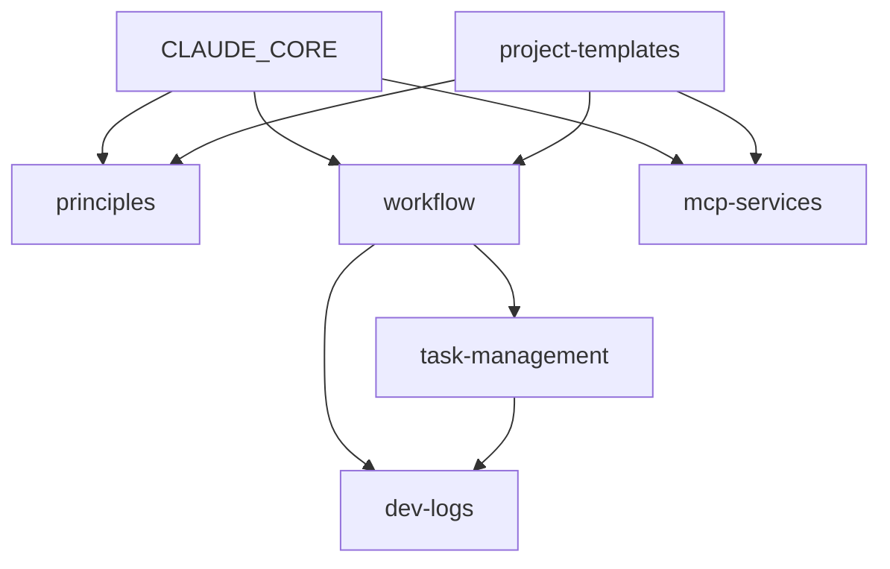

# 模块加载器规范

## 加载语法

### 基础加载
```bash
/load module_name
/load module1, module2, module3
```

### 其他斜杠命令
```bash
/init project_type          # 初始化项目
/apply strategy             # 应用开发策略
/check checklist            # 执行检查清单
/devlog action              # 开发记录管理
```

## 模块依赖关系



## 模块元数据

```yaml
# 每个模块应包含的元数据
module:
  name: "module_name"
  version: "1.0.0"
  description: "模块描述"

  dependencies:
    required: []      # 必需依赖
    optional: []      # 可选依赖

  triggers:
    auto_load: []     # 自动加载条件
    keywords: []      # 触发关键词

  size: "small"       # small | medium | large
  load_time: "fast"   # fast | normal | slow
```

## 加载优先级

### 加载顺序
1. **核心模块**（自动加载）
   - CLAUDE_CORE.md

2. **项目模块**（如存在）
   - .claude/project.md
   - .claude/local.md

3. **按需模块**（显式请求）
   - 通过 `/load` 命令
   - 通过任务触发

4. **延迟模块**（使用时加载）
   - 大型模块
   - 特定场景模块

## 智能加载规则

### 任务触发加载
```python
task_modules = {
    "重构": ["principles", "workflow", "testing"],
    "性能优化": ["performance", "chrome-devtools"],
    "安全审计": ["security", "code-review"],
    "新项目": ["project-templates", "dev-logs"],
    "调试": ["mcp-services", "workflow"],
    "文档": ["dev-logs"],
}

def auto_load_for_task(task_description):
    for keyword, modules in task_modules.items():
        if keyword in task_description:
            load_modules(modules)
```

### 文件类型触发
```python
file_modules = {
    "*.test.*": ["testing"],
    "*.spec.*": ["testing"],
    "Dockerfile": ["docker", "deployment"],
    "*.sql": ["database"],
    ".env*": ["security"],
    "package.json": ["nodejs", "dependencies"],
}
```

### 错误触发
```python
error_modules = {
    "性能问题": ["performance", "chrome-devtools"],
    "安全漏洞": ["security"],
    "测试失败": ["testing", "workflow"],
    "构建失败": ["build", "dependencies"],
}
```

## 模块缓存策略

### 缓存级别
```yaml
cache_policy:
  always:     # 总是缓存
    - principles
    - workflow

  session:    # 会话期间缓存
    - mcp-services
    - project-templates

  never:      # 从不缓存
    - security  # 总是最新
    - performance  # 实时数据
```

### 缓存失效
```python
def invalidate_cache(module_name):
    triggers = [
        "文件修改",
        "配置更新",
        "版本升级",
        "手动刷新"
    ]
    # 清除缓存逻辑
```

## 模块组合模式

### 开发模式组合
```bash
# 标准开发
/load principles, workflow, dev-logs

# TDD 开发
/apply tdd

# 全栈开发
/load principles, workflow, mcp-services, project-templates
```

### 场景模式组合
```bash
# 代码审查场景
/load principles, code-review, testing

# 性能调优场景
/load performance

# 安全加固场景
/check security
```

## 模块版本管理

### 版本兼容性
```yaml
compatibility:
  "1.0.0":
    min_core: "3.0.0"
    max_core: "4.0.0"

  "2.0.0":
    min_core: "4.0.0"
    requires:
      - "workflow >= 2.0"
```

### 版本选择
```bash
/load module_name@1.0.0   # 指定版本
/load module_name@latest  # 最新版本
/load module_name@stable  # 稳定版本
```

## 错误处理

### 加载失败处理
```python
def handle_load_error(module_name, error):
    strategies = {
        "NOT_FOUND": suggest_alternatives,
        "VERSION_MISMATCH": load_compatible_version,
        "DEPENDENCY_MISSING": load_dependencies_first,
        "NETWORK_ERROR": use_cached_version,
    }

    return strategies[error.type](module_name)
```

### 降级策略
```yaml
fallback_chain:
  performance:
    - chrome-devtools
    - basic-metrics
    - manual-analysis

  mcp-services:
    - remote-services
    - cached-results
    - local-tools
```

## 性能优化

### 预加载策略
```python
# 基于历史使用预测
def predict_modules(context):
    history = get_usage_history()
    predictions = ml_predict(context, history)

    for module in predictions:
        if module.probability > 0.8:
            preload(module)
```

### 懒加载实现
```python
class LazyModule:
    def __init__(self, module_name):
        self.module_name = module_name
        self._module = None

    def __getattr__(self, attr):
        if self._module is None:
            self._module = load_module(self.module_name)
        return getattr(self._module, attr)
```

## 监控和分析

### 使用统计
```yaml
analytics:
  track:
    - module_loads
    - load_times
    - error_rates
    - usage_patterns

  report:
    frequency: daily
    format: json
    destination: .ai-dev-logs/metrics/
```

### 优化建议
```python
def analyze_usage():
    stats = get_usage_stats()

    suggestions = []
    if stats.load_time > 1000:  # ms
        suggestions.append("考虑拆分大模块")

    if stats.error_rate > 0.05:
        suggestions.append("检查模块兼容性")

    return suggestions
```

---
**文件类型**：系统规范
**用途**：模块加载和管理
**重要性**：核心机制
**版本**：3.1
**更新**：2025-11-30